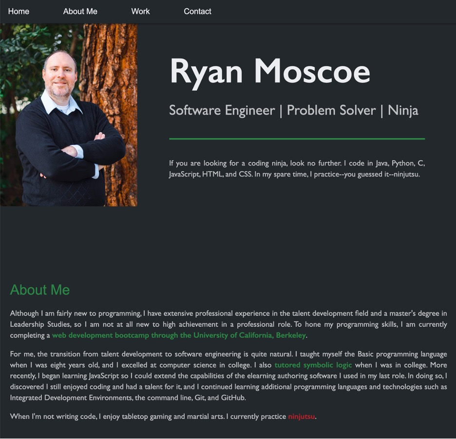
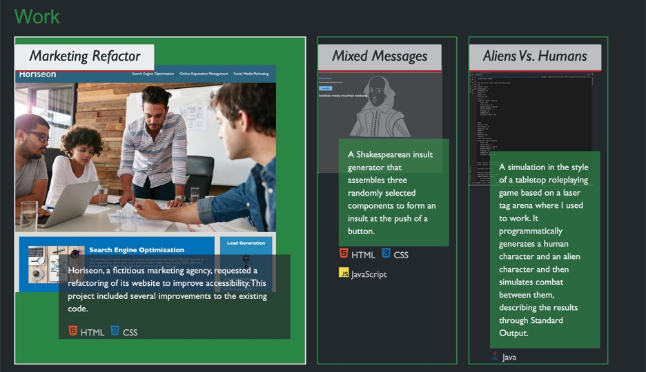

# portfolio

## Technology Used 

| Technology Used         | Resource URL           | 
| ------------- |:-------------:| 
| HTML    | [https://developer.mozilla.org/en-US/docs/Web/HTML](https://developer.mozilla.org/en-US/docs/Web/HTML) | 
| CSS     | [https://developer.mozilla.org/en-US/docs/Web/CSS](https://developer.mozilla.org/en-US/docs/Web/CSS)      |   
| Git | [https://git-scm.com/](https://git-scm.com/)     |    

 
## Description 

[Visit my live portfolio.](https://rmoscoe.github.io/portfolio/)

I built this responsive webpage as a portfolio to showcase my most important and impressive work. The projects I selected for my portfolio demonstrate my skill with a variety of technologies as well as my evolution as a developer. The portfolio page itself also serves as an example of my skill with HTML and CSS.

 
## Usage and Examples

Clicking the screenshots below will take you to the live portfolio. I will continue to update the portfolio during my coding bootcamp, so if you don't see all the technologies or capabilities you're looking for today, please check back in a week or two.

This first image shows the top of the portfolio page with the navigation bar, hero section, and About Me section.

 
This second image shows a portion of the Work section of the portfolio. On the portfolio page, click the image of any project to navigate to that project.

 
## Learning Points 

I was already familiar with HTML and using CSS for styling, but I learned a lot about using CSS for positioning and responsiveness by completing this project.

* ***Flexboxes!!!***
* The Viewport Width (vw) unit of measure
* Media queries 
* The position property
